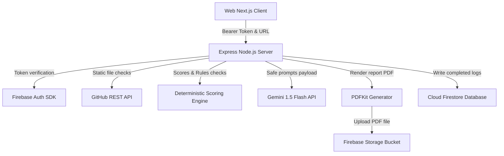

# System Architecture & Design

This document details the modular layout and execution pipelines of the **AI-Powered GitHub Project Analyzer & Deployment Readiness Checker**.

---

## Technical Block Diagram

---

## Major Subsystems & Workflows

### 1. Security Rules Verification
- **Token Verification:** Every protected request carries a `Authorization: Bearer <ID_TOKEN>` header. The Express backend uses `firebase-admin` to decrypt the token, extracting the verified `uid` and `email`.
- **Database Rules:** Firebase Security Rules prevent users from query-accessing any data outside of their own `userId` and block updating roles to `admin`/`mentor` from the client side.

### 2. GitHub Static Scanning Sequence
1. **URL Normalization:** Parses standard, raw, or git URLs to extract `owner` and `repository`.
2. **Metadata Fetch:** Queries repo settings, sizes, forks, and stargazers to evaluate popularity metrics.
3. **Recursive File Tree Traversal:** Downloads the repository tree up to **1000 items** in a single API round-trip, avoiding cloning codes on local servers.
4. **Target File Reading:** Downloads files matching `README.md`, `package.json`, `.gitignore`, and `.env.example` using strict file size limitations (100KB max per file) and skipping binaries.

### 3. Analytics & Technology Audit
- Scans `dependencies` and `devDependencies` in `package.json` to identify frameworks.
- Looks for config files (`tsconfig.json`, `tailwind.config.js`, `vercel.json`) to confirm technology confidence ratios.
- Audits safety risks by scanning for committed files matching secrets patterns (e.g. `.env`, `.pem`, `id_rsa`, `firebase-key.json`).

### 4. Scoring Framework
A transparent scoring matrix totalling **100 points**:
- **Repository Structure (25pts):** Tests for `.gitignore`, sub-folder structure separation, lockfiles, configuration files.
- **README documentation (20pts):** Checks sections like installation, demo link, screenshots, license, contact details.
- **Deployment readiness (25pts):** Checks build scripts, start scripts, cloud hosting configs, localhost leaks.
- **Security & Safety (15pts):** Deducts points for exposed environment credentials, committed dependencies (`node_modules`), or build cache folders.
- **Project completeness (10pts):** Validates package files, licenses, API endpoints specs.
- **Portfolio presentations (5pts):** Rewards including active screenshots and live demo anchors.

### 5. AI Suggestions Pipeline
- Aggregates findings into a safe JSON prompt payload (scores, missing files, security warnings, language shares). No raw codebase strings are forwarded.
- Instructs **Gemini 1.5 Flash** with `responseMimeType: "application/json"` to provide resume CV bullet points, portfolio summaries, and priority recommendations.
- Implements a rule-based **Deterministic Fallback Engine** that generates suggestions if the Gemini API key is missing or fails.

### 6. PDF Report Generator
- Leverages `pdfkit` to draw page grids, score metrics tables, issue listings, and CV advice on A4 pages.
- Automatically pushes compiled PDF files to `reports/{userId}/{analysisId}/analysis-report.pdf` on Firebase Storage and deletes temporary files from the server's cache.
- Generates secure signed download links valid for a customizable duration.
